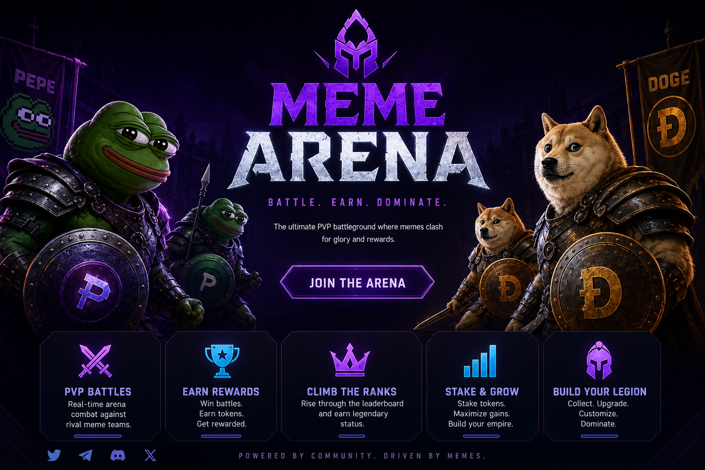
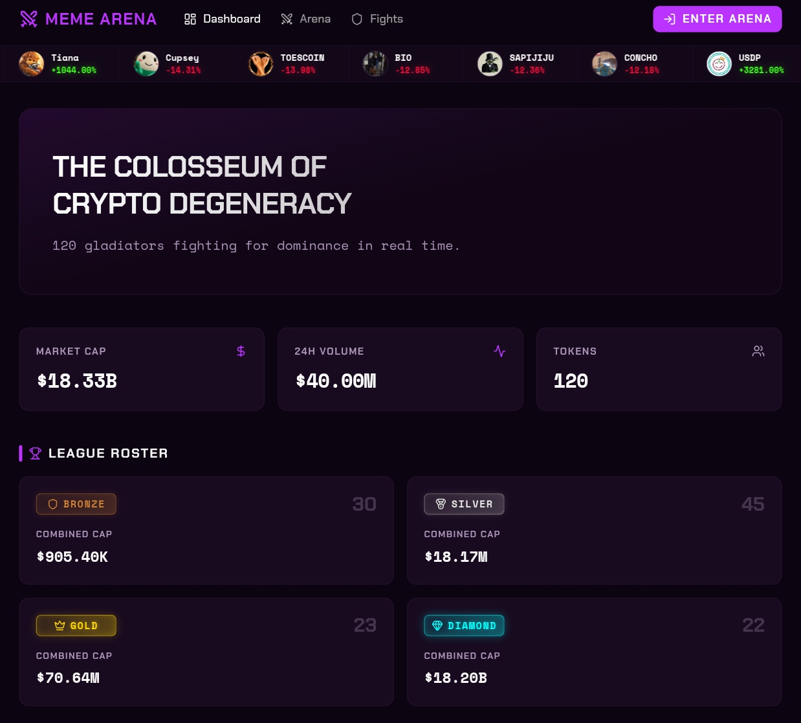

# Welcome to Meme Arena

<figure><figcaption></figcaption></figure>

## The Colosseum of Crypto Degeneracy

**Meme Arena** is a real-time prediction platform on Solana where meme tokens fight each other in live, on-chain battles. Instead of paper trading or endless chart watching, you pick a side, place your prediction, and watch the market decide the winner — in 5 minutes.

No luck. No randomness. Pure market performance.

***

## What Makes Meme Arena Different

<table data-view="cards"><thead><tr><th>Feature</th><th>Description</th></tr></thead><tbody><tr><td>📊 <strong>Market-driven</strong></td><td>Winners are determined by real on-chain volume and market cap — never by a random number generator</td></tr><tr><td>⚡ <strong>Speed</strong></td><td>Each match lasts <strong>5 minutes</strong>. Three matches make a full fight. Results in 15 minutes</td></tr><tr><td>🛡️ <strong>Fair play</strong></td><td>Tokens pass rigorous security checks before entering. No rug-pull tokens. No honeypots</td></tr><tr><td>💰 <strong>Peer-to-peer pool</strong></td><td>The Accuracy Pool distributes rewards from other predictors, not from a house bankroll</td></tr><tr><td>🔐 <strong>Wallet-native</strong></td><td>Connect any Solana wallet. No email. No KYC. Your keys, your identity</td></tr></tbody></table>

***

## The Platform at a Glance

<figure><figcaption></figcaption></figure>

***

## The Core Loopo

```
Discover a Fight  →  Place Your Prediction  →  Watch the Battle  →  Collect Rewards
     (Arena)              (2-min window)          (5-min round)       (Accuracy Pool)
```

1. **Browse the Arena** — see live fights across 4 leagues (Bronze → Diamond)
2. **Pick your fighter** — back the token you believe will outperform in the next 5 minutes
3. **Place your prediction** — spend Points to enter the Accuracy Pool
4. **Watch live** — track volume and market cap in real time
5. **Collect** — winners share the pool proportional to their stake

***

## Getting Started

<table data-card-size="large" data-view="cards"><thead><tr><th></th><th></th><th data-type="content-ref"></th><th data-hidden data-card-target data-type="content-ref"></th><th data-hidden data-card-cover data-type="image">Cover image</th></tr></thead><tbody><tr><td><strong>🔗 How it Works?</strong></td><td>Learn a general introduction to project performance</td><td><a href="overview/how-it-works.md">how-it-works.md</a></td><td><a href="account/connecting-wallet.md">connecting-wallet.md</a></td><td><a href=".gitbook/assets/1000375096 (1).png">1000375096 (1).png</a></td></tr><tr><td><strong>⚔️ Understand the Leagues</strong></td><td>From micro-cap Bronze fighters to mega-cap Diamond gladiators.</td><td><a href="predictions/placing-predictions.md">placing-predictions.md</a></td><td><a href="arena/leagues.md">leagues.md</a></td><td><a href=".gitbook/assets/1000375073 (1).jpg">1000375073 (1).jpg</a></td></tr><tr><td><strong>🎯 Place Your First Prediction</strong></td><td>How the Accuracy Pool works and how rewards are calculated.</td><td></td><td><a href="predictions/placing-predictions.md">placing-predictions.md</a></td><td><a href=".gitbook/assets/1000375074.jpg">1000375074.jpg</a></td></tr><tr><td>🔗 Connect Wallet</td><td>Start with any Solana wallet. Takes 30 seconds.</td><td><a href="account/connecting-wallet.md">connecting-wallet.md</a></td><td></td><td><a href=".gitbook/assets/1000375069.jpg">1000375069.jpg</a></td></tr></tbody></table>
