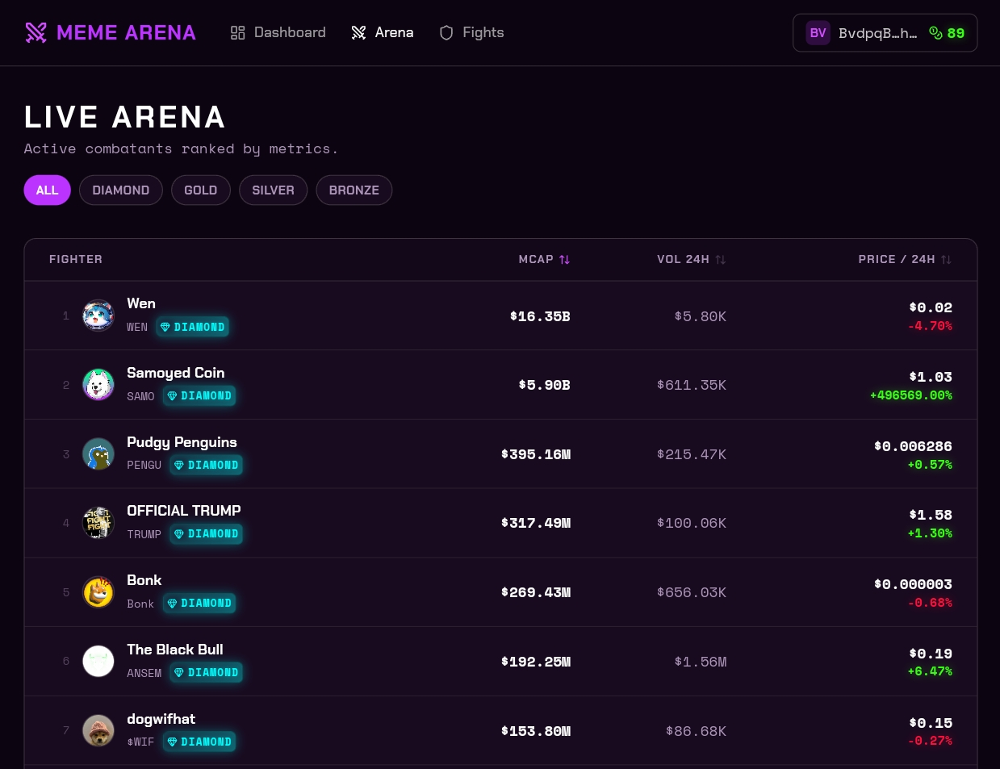

# Fighters (Tokens)

Every token in the Arena is a **fighter** — a live Solana meme token competing based on its real on-chain market performance.

<figure><figcaption></figcaption></figure>

***

## How Tokens Become Fighters

### Automatic Discovery

The platform runs a continuous discovery pipeline across three data sources:

* **DexScreener** — monitoring all new Solana pairs as they appear
* **PumpPortal** — live stream of Pump.fun mints and migrations
* **PumpFun API** — top performers and recent graduates

### Admission Requirements

A token must clear **all** gates simultaneously:

| Gate             | Threshold                       | Why                                               |
| ---------------- | ------------------------------- | ------------------------------------------------- |
| Mint Authority   | Revoked                         | Prevents unlimited inflation of supply            |
| Freeze Authority | Revoked                         | Prevents honeypot (issuer can't freeze wallets)   |
| Liquidity        | ≥ $5,000                        | Ensures token is actually tradable                |
| 24h Volume       | ≥ $1,000                        | Ensures active market participation               |
| Pair Age         | ≥ 6h (15 min for PumpFun grads) | Filters bot-launch tokens                         |
| FDV / MCap ratio | ≤ 10×                           | Weeds out VC tokens with locked supply            |
| Meme Signal      | Must pass heuristic             | No stablecoins, wrapped assets, or utility tokens |


**Security note:** Mint and freeze authority checks are performed via the Helius Solana RPC API, reading directly from on-chain data. This cannot be spoofed.


***

## Fighter Profiles

Every fighter has a dedicated profile page showing:

* **Identity** — token name, symbol, contract address, league badge
* **AI-generated portrait** — unique gladiator artwork generated for each fighter at admission
* **Live stats** — current price, market cap, 24h volume, liquidity, 24h price change
* **Fight history** — win/loss record across all completed matches
* **Archetype** — a character class assigned based on the token's performance profile

***

## Fighter Lifecycle

```
Discovery
    ↓
Security Screening  (mint/freeze/liquidity/volume/age/FDV checks)
    ↓
Admission → Active  (eligible for matchmaking)
    ↓
Fight  →  1-hour cooldown
    ↓
Back to Active
    ...
    ↓
Deactivation  (if volume/liquidity drops below thresholds)
```

### Staying Active

A token remains eligible for matchmaking as long as it maintains:

* ≥ **$500** liquidity
* ≥ **$500** 24h volume

If a token falls below these thresholds, it is marked **inactive** and removed from matchmaking. Fight history is preserved. The token may return to active status if metrics recover.


**Seed tokens** (a curated set of hand-picked addresses) are permanently exempt from deactivation. They stay in the Arena regardless of metrics.


***

## Anti-Collusion

The platform tracks the **on-chain deployer wallet** for every token (fetched via Helius DAS API at admission). Two tokens sharing the same deployer can **never be matched against each other**.

This prevents a token creator from deploying two tokens and coordinating their performance during a fight to profit at predictors' expense.
