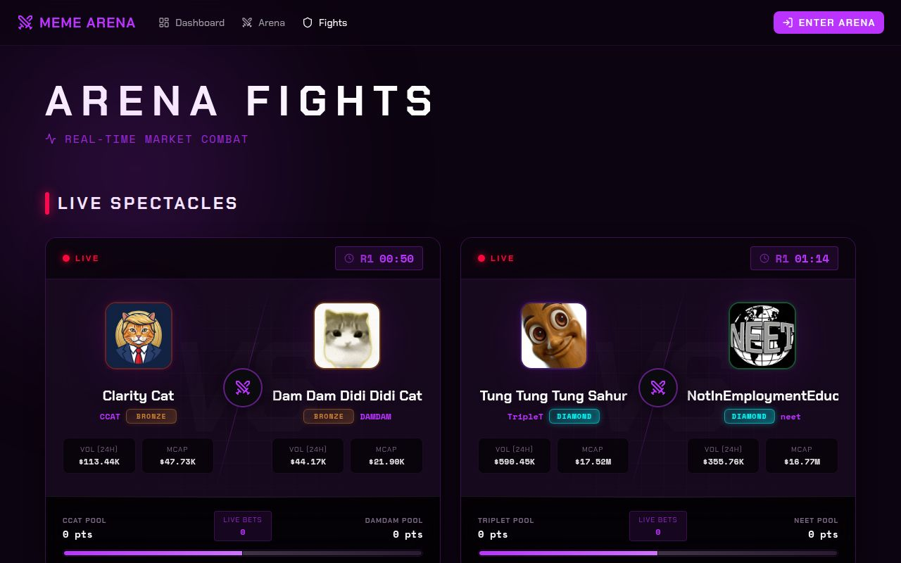

# Fights & Matches

Understanding the difference between a **Match** and a **Fight**, and how each is scored, is the foundation of making good predictions.

<figure></figure>

---

## Terminology

| Term | Definition |
|---|---|
| **Match** | A single 5-minute round between two tokens. One winner per match. |
| **Fight** | A best-of-3 series: 3 consecutive Matches. One overall winner per fight. |
| **Betting Window** | The 2-minute period before a Match starts. Only time predictions can be placed. |
| **Accuracy Pool** | The prize pool for a given match, split between winning predictors. |

---

## Fight Structure

```
FIGHT  (≈15 minutes total)
│
├── Match 1  ──── [Betting: 2 min] ──── [Live: 5 min] ──── [Settled]
│
├── Match 2  ──── [Betting: 2 min] ──── [Live: 5 min] ──── [Settled]
│
└── Match 3  ──── [Betting: 2 min] ──── [Live: 5 min] ──── [Settled]

Fight winner = token that wins 2 or more of the 3 matches
```


Accuracy Pools settle **per match** — you don't need to wait for the entire fight to finish to collect rewards.


---

## How a Winner Is Determined

At the end of each 5-minute round, the platform snapshots both fighters' on-chain data and compares it to the snapshot at round start:

**Two metrics are measured:**

1. **Trading Volume** — total USD volume generated during the 5-minute window
2. **Market Cap Change** — percentage change from start to end of round

The token with stronger combined performance wins the match. This is raw market data pulled from DexScreener — not an oracle or synthetic price feed.

---

## The Betting Window

Each match has a **2-minute betting window** that opens before the round starts.

- The live countdown is shown on the fight detail page
- Once the window closes, predictions are **locked** — no new entries, no cancellations
- The Accuracy Pool for that match is finalized at window close


You cannot place, change, or cancel a prediction after the betting window closes.


Fights across the arena are **staggered by ~3.5 minutes** (with random jitter), so there is almost always at least one open betting window in the arena at any given time.

---

## Watching a Live Fight

The **Fight Detail** page shows:

- Live price, volume, and market cap for both fighters (updated continuously)
- A countdown timer showing time remaining in the current round
- Round-by-round scores as they complete
- The current Accuracy Pool size and breakdown for each side
- Your prediction status and projected payout

---

## Post-Fight Cooldown

After a fight concludes:

| Cooldown | Duration |
|---|---|
| Per token (before next fight) | **1 hour** |
| Per pair (before same matchup repeats) | **4 hours** |

All Accuracy Pools settle immediately when the fight ends.
