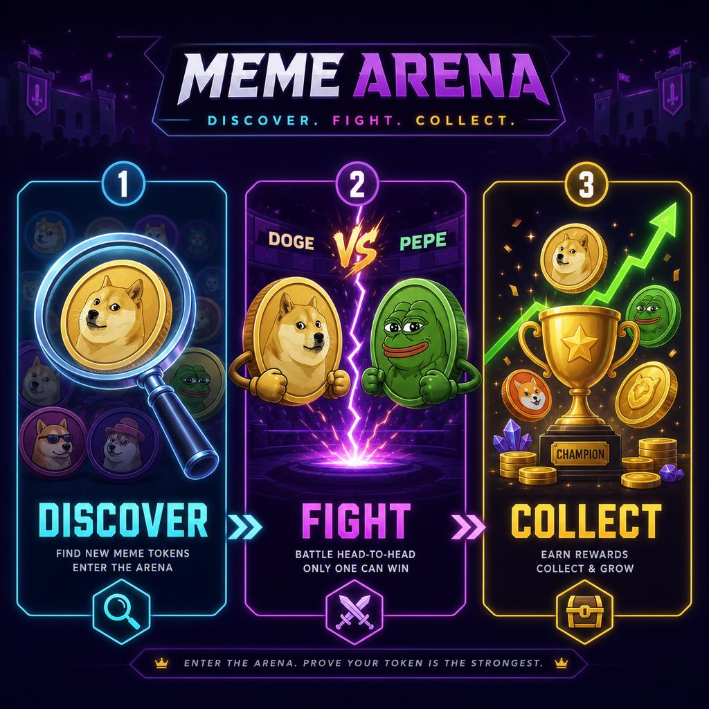
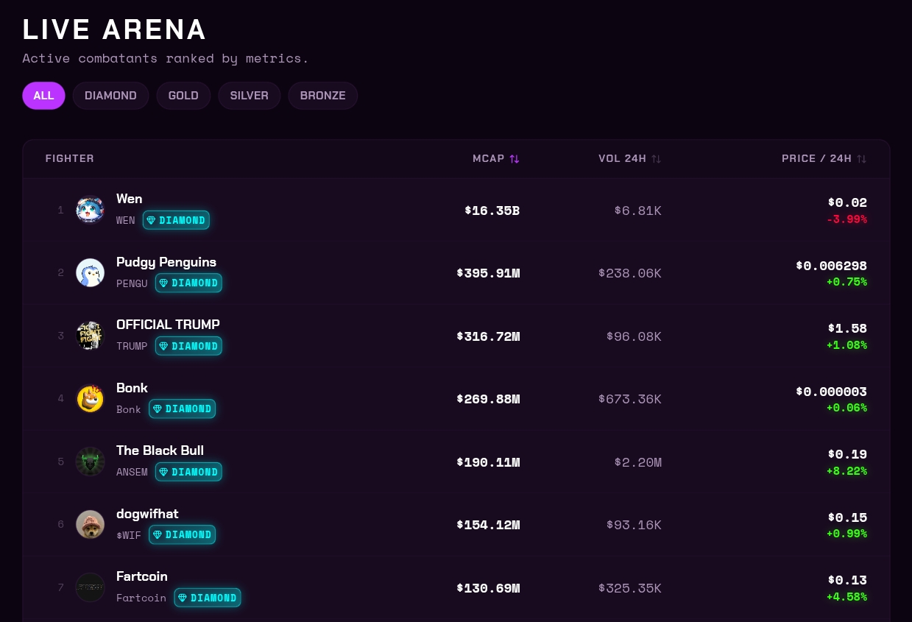
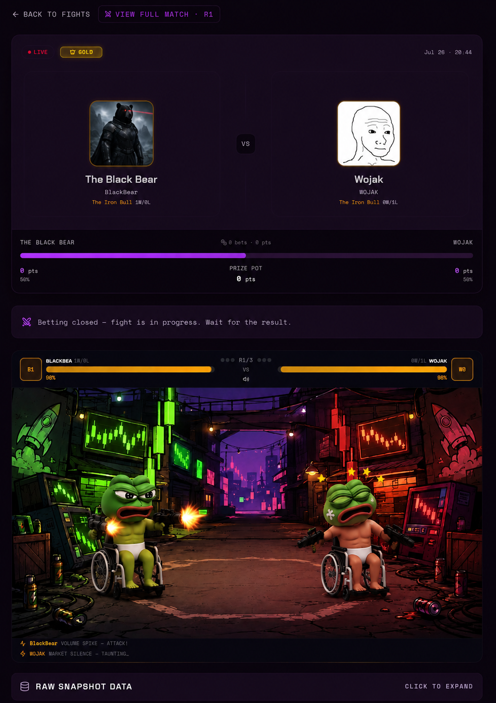
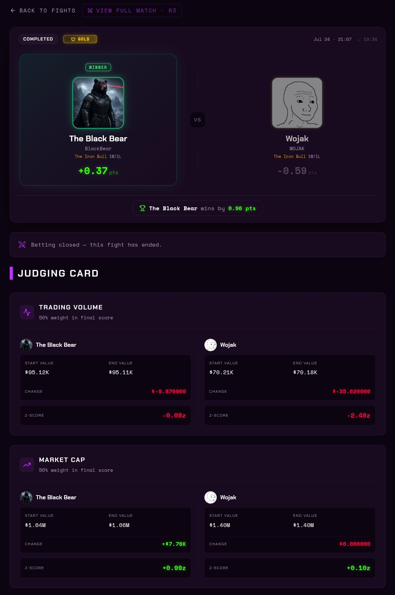
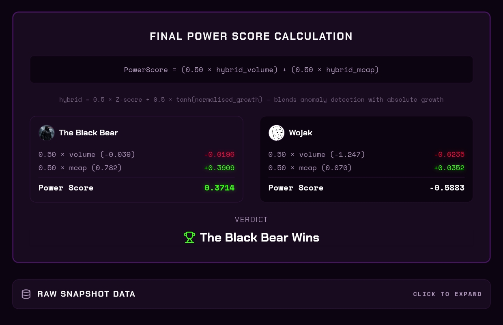

# How It Works

Meme Arena turns live Solana market data into a head-to-head competition. Here's the full picture.

<figure><figcaption></figcaption></figure>

***

## The Token Pipeline

Before any token ever enters the Arena, it goes through an automated discovery and security pipeline.

### 1. Discovery

The platform continuously monitors three live data sources:

* **DexScreener** — the broadest net; catches trending Solana pairs
* **PumpPortal** — real-time feed of new token mints and Pump.fun migrations
* **PumpFun API** — recent and top-performing Pump.fun graduates

### 2. Security Gates

Every newly discovered token must pass **all** of the following checks before admission:

| Check                | Requirement                     | Why It Matters                                  |
| -------------------- | ------------------------------- | ----------------------------------------------- |
| **Mint Authority**   | Revoked                         | No one can print new supply                     |
| **Freeze Authority** | Revoked                         | No one can freeze wallets (honeypot prevention) |
| **Liquidity**        | ≥ $5,000 on-chain               | Token is actually tradable                      |
| **Volume**           | ≥ $1,000 24h                    | Active market participation                     |
| **Pair Age**         | ≥ 6 hours (15 min for Pump.fun) | Filters bot-launch tokens                       |
| **FDV/MCap ratio**   | ≤ 10×                           | No VC-backed / utility tokens                   |
| **Meme Signal**      | Pass name/symbol heuristic      | No stablecoins or wrapped assets                |


Mint and freeze authority checks are performed on-chain via Helius RPC. This cannot be faked.


### 3. League Assignment

Once admitted, tokens are automatically sorted into one of four leagues based on **Market Cap (USD)**:

```
< $100,000          →  🥉 Bronze
$100,000 – $1M      →  🥈 Silver
$1,000,000 – $10M   →  🥇 Gold
> $10,000,000       →  💎 Diamond
```

League assignment is **live** — as a token's market cap changes, it automatically moves up or down.

<figure><figcaption></figcaption></figure>

***

## How a Fight Works

<figure><figcaption></figcaption></figure>

### Matchmaking

The matchmaker runs continuously, pairing tokens within the same league that have:

* Market caps within **20%** of each other
* 24h volumes within **60%** of each other
* No fight in the last **1 hour** (per token)
* No shared **on-chain deployer wallet** (anti-collusion)

### Fight Structure

A **Fight** consists of **3 consecutive Matches**, each a 5-minute live round:

```
FIGHT  (≈15 minutes)
├── Match 1  ← 2 min betting window → 5 min live round → scored
├── Match 2  ← 2 min betting window → 5 min live round → scored
└── Match 3  ← 2 min betting window → 5 min live round → scored

Winner = token that wins 2+ matches
```

<figure><figcaption></figcaption></figure>

### Winning a Match

At the end of each 5-minute round, both tokens are compared against their state at round start:

1. **Trading Volume** generated during the round
2. **Market Cap** change during the round

The token with stronger combined performance wins. This is raw DexScreener market data — no oracle, no synthetic feed.

<figure><figcaption></figcaption></figure>

***

## After the Fight

* **Accuracy Pool** settles immediately: Points distributed to winning predictors
* **Fighter cooldown**: Both tokens rest **1 hour** before their next fight
* **Fight history** is permanently stored and visible in the Fights section


<figure><figcaption></figcaption></figure>

<figure><figcaption></figcaption></figure>
