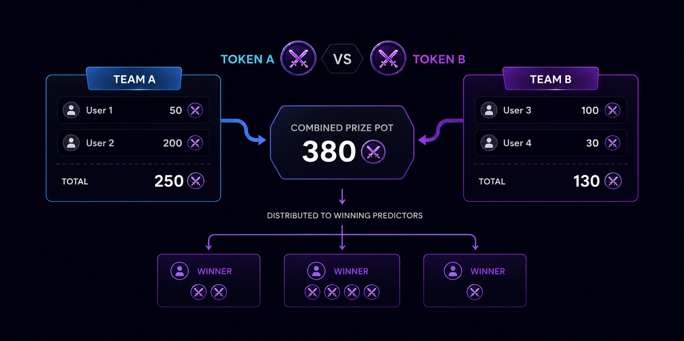

# Accuracy Pool

The Accuracy Pool is the reward mechanism at the heart of Meme Arena. It's a **peer-to-peer prediction pool** — the platform does not take the losing side of your bet. Winning predictors split the losing predictors' stakes.

<figure><figcaption></figcaption></figure>

***

## How It Works

Every match has **two pools** — one for each fighter:

```
Match: TOKEN A  vs  TOKEN B
┌──────────────────────┬───────────────────────┐
│   Pool A (Token A)   │   Pool B (Token B)    │
│                      │                       │
│  User 1 ── 50 pts    │  User 3 ── 100 pts   │
│  User 2 ── 200 pts   │  User 4 ── 30 pts    │
│                      │                       │
│  Total: 250 pts      │  Total: 130 pts       │
└──────────────────────┴───────────────────────┘
       Combined Prize Pot: 380 pts
```

When the 5-minute round ends, all Points from **both pools** are combined into a single prize pot, then distributed to winning predictors **proportionally** to their stake.

***

## Payout Formula

```
Your Payout = (Your Stake ÷ Total Winning Pool) × Total Prize Pot
```

**Example — Token A wins:**

| Predictor | Stake   | Share of Winning Pool | Payout      |
| --------- | ------- | --------------------- | ----------- |
| User 1    | 50 pts  | 50 / 250 = **20%**    | **76 pts**  |
| User 2    | 200 pts | 200 / 250 = **80%**   | **304 pts** |

Total Prize Pot = 380 pts distributed between winners.


The 15 pt entry fee is separate and collected at prediction time — it does not enter the pool and is not included in the payout calculation.


***

## Pool Odds

Because the pool is peer-to-peer, "odds" are determined by where other predictors put their Points:

* **Most Points on Fighter A** → correct prediction on Fighter B pays out **more** (contrarian bet)
* **Even split** → both sides pay roughly even
* **No fixed odds line** — it's a continuous, live pool

The current pool sizes for each fighter are shown **in real time** on the match page.

***

## Settlement

Accuracy Pools settle **automatically** at the end of each 5-minute round:

1. Platform scores the round (winner by volume + market cap growth)
2. Combined pool distributed to winning predictors
3. Points appear in your balance immediately

Pools settle **per match** — you don't wait for the entire 3-match fight to finish.

***

## No House Edge on the Pool

The platform does **not** take a cut of the Accuracy Pool itself. The prize pot equals the sum of all stakes from both sides. The only platform revenue from predictions is the flat **15 pts entry fee** per prediction — separate from the pool.

***

## Integrity Refunds

If a fight is flagged for a data integrity issue (missing DexScreener snapshots, unavailable price data), the fight cannot be scored fairly. In this case:


**All predictors receive a 78% refund** of their original stake. Entry fees (15 pts) are not refunded.


This is a protective mechanism for edge cases — it is not a common occurrence.
